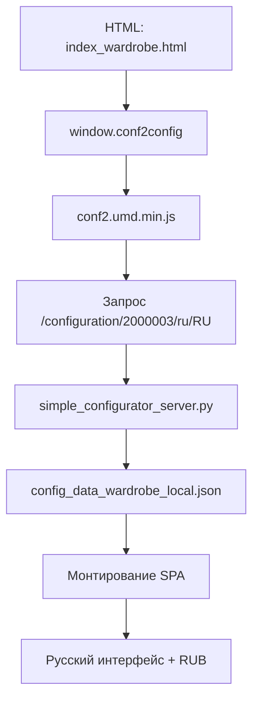

# Архитектура конфигуратора гардероба

## Обзор

Конфигуратор гардероба представляет собой SPA (Single Page Application), которое загружается через HTML-страницу и получает конфигурацию через API эндпоинты.

## Схема загрузки



## Ключевые файлы

### HTML точка входа
- **Файл**: `index_wardrobe.html`
- **Назначение**: Основная страница конфигуратора
- **Конфигурация**: `window.conf2config` с настройками локали и API

### Конфигурация данных
- **Файл**: `config_data_wardrobe_local.json`
- **Назначение**: Локальная конфигурация с переводами и настройками
- **Содержит**: `locale`, `currency`, `translations`, `materials`, `dimensions`

### Сервер
- **Файл**: `simple_configurator_server.py`
- **Порт**: 8081
- **Назначение**: Обслуживание статики и API эндпоинтов
- **Эндпоинты**: `/configuration/{id}/{locale}/{country}`

### Защищённые файлы
- `js/conf2.umd.min.js` - основной бандл конфигуратора
- `js/app.js` - приложение
- `js/cms-elements.js` - CMS элементы

## Инварианты (что нельзя менять)

### Минифицированные файлы
- Запрещено изменять/пересобирать любые минифицированные бандлы
- Контролируется через `scripts/invariants.py` и `scripts/baseline_hashes.json`

### Порядок загрузки
- Запрещено менять порядок `<script>` в HTML
- Разрешено только удалить/закомментировать проблемный `override-ru.js`

### Runtime перехваты
- Запрещены перехваты рантайма
- Не патчить `window.i18n`
- Не переписывать `Intl.NumberFormat`
- Не "гребсти" DOM после загрузки

## Конфигурация

### window.conf2config
```javascript
{
  "productId": 2000003,
  "countryId": 643,
  "locale": "ru-RU",
  "type": "wardrobe",
  "configUrl": "/configuration/2000003/ru/RU"
}
```

### config_data_wardrobe_local.json
```json
{
  "productId": 2000003,
  "type": "wardrobe",
  "locale": "ru",
  "countryId": "RU",
  "currency": "RUB",
  "translations": { ... },
  "materials": [ ... ],
  "dimensions": { ... }
}
```

## Безопасность

### Принципы
- Используем только штатные входные точки
- Не вмешиваемся в жизненный цикл SPA
- Не перехватываем глобальные объекты
- Вся логика работает как задумано

### Контроль качества
- `scripts/invariants.py` - проверка защищённых файлов
- `scripts/baseline_hashes.json` - хэши для сравнения
- Git теги для отката
- Документация изменений

## Развёртывание

### Локальная разработка
1. Запустить `python3 simple_configurator_server.py`
2. Открыть `http://localhost:8081/index_wardrobe.html`
3. Проверить `python3 scripts/invariants.py`

### Продакшн
- Статические файлы можно развернуть на любом веб-сервере
- API эндпоинты должны быть доступны
- CORS настроен для `*`

## Мониторинг

### Логи
- Сервер логирует все запросы
- Ошибки отображаются в консоли браузера

### Метрики
- Время загрузки конфигурации
- Количество переводов
- Статус защищённых файлов
